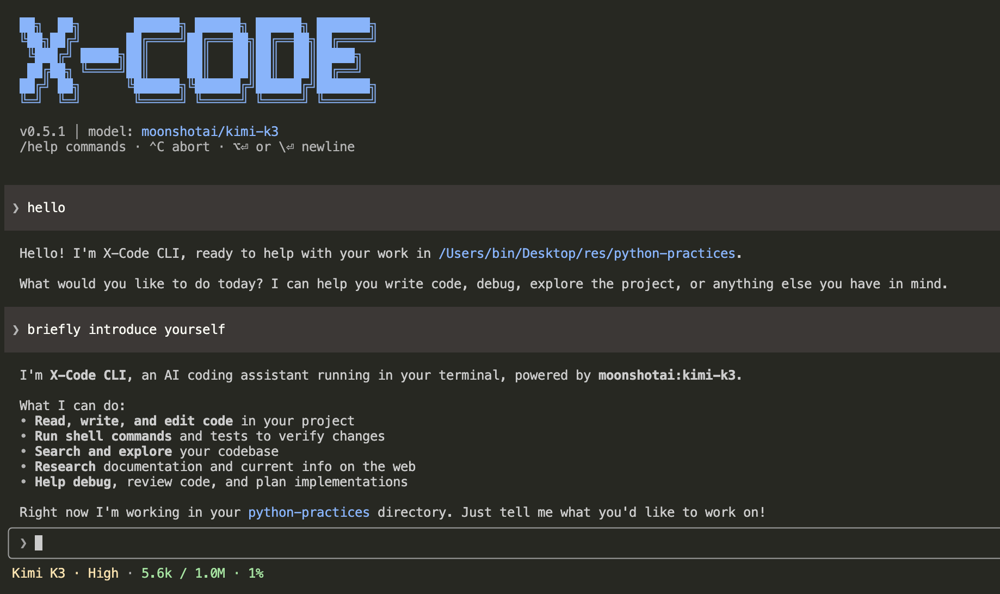

<div align="center">

# X-Code CLI

**A model-agnostic coding agent CLI with Claude Code-compatible extensions.**

Use Claude, GPT, Gemini, DeepSeek, Qwen, Kimi, or any OpenAI-compatible model in one open-source agent workflow.

[](https://www.npmjs.com/package/@x-code-cli/cli)
[](./LICENSE)

English · [简体中文](./README.zh-CN.md)



</div>

## Why X-Code CLI?

**Model agnostic** — Switch providers at any time with `/model`, or connect any OpenAI-compatible endpoint. One workflow, any model.

**Claude Code-compatible extensions** — Reuse plugins, skills, sub-agents, MCP servers, and hooks built for Claude Code. The plugin loader recognizes both `.x-code-plugin/` and `.claude-plugin/` formats.

**Open and controllable** — Open source, BYOK, local execution, configurable 3-level permission model. You decide what the agent can do.

**Complete agent runtime** — More than a chat wrapper: it covers planning, execution, memory, context management, and task verification.

> X-Code CLI is an independent open-source project and is not affiliated with Anthropic.

## Install

> Requires **Node.js >= 22** (Node 20 is not supported).

```bash
npm install -g @x-code-cli/cli

# Or
pnpm add -g @x-code-cli/cli
```

After installation, launch with the `xc` or `x-code` command.

## Configure API Keys

> **X-Code CLI does not bundle a free model. At least one provider API key must be configured.**
>
> **Recommended: [DeepSeek](https://platform.deepseek.com/)** — affordable and capable enough for everyday coding. Promotional credits and prices can change; check the official console for current terms.

| Variable                       | Provider           | Sign up                                                                     |
| ------------------------------ | ------------------ | --------------------------------------------------------------------------- |
| `ANTHROPIC_API_KEY`            | Anthropic (Claude) | [console.anthropic.com](https://console.anthropic.com/)                     |
| `OPENAI_API_KEY`               | OpenAI (GPT)       | [platform.openai.com/api-keys](https://platform.openai.com/api-keys)        |
| `DEEPSEEK_API_KEY`             | DeepSeek           | [platform.deepseek.com/api_keys](https://platform.deepseek.com/api_keys)    |
| `GOOGLE_GENERATIVE_AI_API_KEY` | Google (Gemini)    | [aistudio.google.com/apikey](https://aistudio.google.com/apikey)            |
| `ALIBABA_API_KEY`              | Alibaba (Qwen)     | [dashscope.console.aliyun.com](https://dashscope.console.aliyun.com/apiKey) |
| `XAI_API_KEY`                  | xAI (Grok)         | [console.x.ai](https://console.x.ai/)                                       |
| `ZHIPU_API_KEY`                | Zhipu (GLM)        | [open.bigmodel.cn](https://open.bigmodel.cn/usercenter/apikeys)             |
| `MOONSHOT_API_KEY`             | Moonshot (Kimi)    | [Choose a service](#moonshot-kimi-endpoints)                                |

**OpenAI-compatible escape hatch** (vLLM / OpenRouter / internal gateways): set both `OPENAI_COMPATIBLE_API_KEY` and `OPENAI_COMPATIBLE_BASE_URL`, then address models as `custom:<your-model-id>`.

<details>
<summary><b>Shell configuration examples</b> (click to expand)</summary>

The examples below use `DEEPSEEK_API_KEY`; substitute your provider's variable name.

**bash (Linux / Git Bash / WSL)**

```bash
echo 'export DEEPSEEK_API_KEY=sk-...' >> ~/.bashrc
source ~/.bashrc
```

**zsh (macOS default)**

```bash
echo 'export DEEPSEEK_API_KEY=sk-...' >> ~/.zshrc
source ~/.zshrc
```

**fish**

```fish
set -Ux DEEPSEEK_API_KEY sk-...
```

**Windows PowerShell (user-level, persistent)**

```powershell
[Environment]::SetEnvironmentVariable('DEEPSEEK_API_KEY', 'sk-...', 'User')
# Restart PowerShell to take effect
```

**Windows CMD (user-level, persistent)**

```cmd
setx DEEPSEEK_API_KEY "sk-..."
:: Restart CMD to take effect
```

> For temporary use: `export X=...` (bash) or `$env:X = '...'` (PowerShell); discarded when the terminal closes.
>
> Per-project: place a `.env` file in or above the launch directory. `xc` walks upward and loads only the first file it finds.

</details>

<details>
<summary><b>Web search keys (optional)</b></summary>

To enable the `webSearch` tool, configure either of the following. Both offer a free tier:

| Variable         | Provider                                      | Current free quota                        | Signup         |
| ---------------- | --------------------------------------------- | ----------------------------------------- | -------------- |
| `TAVILY_API_KEY` | [Tavily](https://tavily.com)                  | 1,000 API credits/month                   | Email, no card |
| `BRAVE_API_KEY`  | [Brave Search](https://brave.com/search/api/) | $5 credits/month (~1,000 Search requests) | Card required  |

> Tavily is recommended for first-time setup: simpler signup, LLM-optimized responses. When both are set, Tavily is preferred and Brave serves as fallback.

</details>

<details id="moonshot-kimi-endpoints">
<summary><b>Moonshot (Kimi) endpoint note</b></summary>

Moonshot/Kimi credentials come from three separate services. A key only works with the endpoint of the service that issued it:

- Kimi Code plan: [Kimi Code console](https://www.kimi.com/code/console) → `https://api.kimi.com/coding/v1`
- China Open Platform: [platform.kimi.com](https://platform.kimi.com/console/api-keys) → `https://api.moonshot.cn/v1`
- International Open Platform: [platform.kimi.ai](https://platform.kimi.ai/console/api-keys) → `https://api.moonshot.ai/v1`

After selecting a Kimi model via `/model`, an endpoint picker appears automatically.

</details>

## Quick Start

```bash
cd your-project

xc                                              # Interactive session
xc "Explain the overall architecture"           # Run with a prompt
xc -m sonnet "Refactor the formatDate function" # Specify a model
```

## Key Features

### Intelligent Development

- **Built-in tools** — file I/O, shell execution, code search (Grep / Glob), web fetch, sub-agent delegation, todo tracking, and more
- **Sub-agents** — ships with 5 (explore / general-purpose / plan / code-reviewer / goal-verifier), supports custom agents
- **Plan mode** — `--plan` or `/plan` enters read-only exploration; the agent designs a plan, then executes after approval
- **Durable goal loops** — `/goal` runs execute → verify → repair cycles until passing or hitting a stop condition
- **Model-directed Git worktrees** — when repository state and verification risk warrant it, the agent can use ordinary Git commands to create and clean up a temporary worktree instead of risking the active checkout
- **Cross-session messaging** — named local sessions can discover one another and exchange peer-authorized work (macOS / Linux; see [docs](./docs/peer-messaging.en.md))
- **File attachments** — `@path` or bare absolute paths auto-ingest text / code / PDF / Office docs (docx / xlsx / pptx / odt / ods / odp) / images / audio
- **Local audio transcription** — attach MP3 / WAV / M4A / OGG / FLAC / AAC / AIFF / WMA / WebM / Opus files; when the active model can't take audio input, X-Code CLI transcribes them locally via Whisper (whisper.cpp) and feeds the model timestamped text — the audio never leaves your machine. The Whisper model auto-downloads on first use and is cached under `~/.x-code/whisper-models/` (default `tiny`; set `X_CODE_WHISPER_MODEL` to pick another, e.g. `base`)
- **Vision sub-agent** — text-only providers (e.g. DeepSeek) can borrow a configured vision model for image understanding

### Context Management

- **Knowledge system** — layered `AGENTS.md` loading (compatible with `CLAUDE.md`), subpackages override root
- **Auto-memory** — durable facts are extracted after each completed root-agent turn and recalled on demand
- **Session resumption** — `--continue` resumes the last session, `--resume` opens a picker or jumps by ID / fork name
- **Session branching** — `/fork [name]` copies completed context into an independent conversation, even while the current request is running; branches still share the same working tree
- **Context compression** — long conversations auto-compress; loop-guard detects cycles; prompt cache reuses prefixes
- **3-level permission model** — safe by default, prompts according to tool and command risk; `--trust` skips ordinary tool confirmations, including peer-triggered work

### Extension Ecosystem

- **MCP integration** — stdio + HTTP (with OAuth), `/mcp` management, server tools merge into agent toolset
- **Plugin system** — bundle skills / sub-agents / commands / MCP / hooks; supports common Claude Code plugin conventions
- **Skills** — reusable workflow templates as `SKILL.md`, triggered via `/<skill-name>`
- **Custom slash commands** — drop markdown into `~/.x-code/commands/` or project scope, invoke with `/<name>`
- **Hooks** — 10 lifecycle event callbacks to intercept or rewrite agent behavior via shell commands
- **Browser automation** — automatic one-shot local UI screenshots (`/browser check-off` disables them); `/browser on` additionally enables an interactive browser sub-agent

### Terminal Experience

- **Streaming output** — results render as they are generated
- **Theme switching** — `/theme` controls diff colors and syntax-highlight palette
- **Unified thinking mode** — `/thinking on|off` consolidates provider-specific reasoning parameters
- **Multiline input** — `Alt+Enter` or trailing `\` inserts a newline
- **Input history** — `↑`/`↓` on empty prompt recalls previous messages
- **Mid-turn steering** — keep typing while the agent is working: your message is queued above the spinner and injected at the next tool boundary
- **Live footer** — the active model and current context usage (e.g. `Kimi K3 · 6.6k / 200k · 3%`) are always visible under the input
- **Background terminals** — long commands become manageable shell sessions; inspect them with `/ps` and stop them with `/stop [shell-id]` (see the [guide](./docs/shell-sessions.en.md))
- **Cross-platform** — Windows, macOS, Linux

## CLI Options

```text
xc [options] [prompt]

--model, -m <id>      Model to use (e.g. sonnet, deepseek, openai:gpt-5.6-sol)
--trust, -t           Trust mode: skip ordinary tool confirmations, including peer-triggered work
--print, -p           Non-interactive mode: print result and exit
--plan                Start in plan mode (read-only; user approves before edits)
--name <name>         Name this interactive session and enable local peer messaging
--continue, -c        Resume the most recent session (no picker)
--resume, -r [id|name] Resume a session: picker, session ID, or fork name
--max-turns <n>       Agent loop turn cap per submit (default: unlimited)
--no-plugins          Disable the plugin system (built-in only; for triage)
--no-hooks            Skip all hook execution
--plugin-debug        Mirror plugin/hook debug logs to stderr
--version, -v         Show version
--help, -h            Show help
```

### Non-interactive subcommands

```text
xc plugin <subcommand>            Manage plugins (list / install / uninstall / enable / disable / search / update / info / doctor / marketplace)
xc plugin install [--yes] <src>   Install a plugin; --yes skips confirmation
xc plugin marketplace <sub>       Manage marketplace subscriptions (list / add / remove / refresh / info)
```

## Slash Commands

| Command                | Description                                                          |
| ---------------------- | -------------------------------------------------------------------- |
| `/help`                | Show available commands                                              |
| `/model [alias]`       | Switch model or list available models                                |
| `/thinking [on\|off]`  | Enable / disable thinking mode                                       |
| `/theme [name]`        | Switch UI theme                                                      |
| `/plan [on\|off]`      | Enable / disable plan mode                                           |
| `/goal [objective]`    | Start a durable goal loop (see [docs/goal.en.md](./docs/goal.en.md)) |
| `/usage`               | Token usage: context split, per-step detail, attribution, cache hits |
| `/usage-history`       | List past session usage                                              |
| `/clear`               | Clear the current conversation                                       |
| `/ps`                  | List running background terminals and recent output                  |
| `/stop [shell-id]`     | Stop one background terminal, or all when no ID is given             |
| `/clear-peer-context`  | Remove the peer-influenced conversation suffix after confirmation    |
| `/list-agents`         | List reachable named X-Code sessions                                 |
| `/compact`             | Manually compress context                                            |
| `/resume`              | Pick a past session to resume                                        |
| `/fork [name]`         | Branch completed context with an optional name (working tree shared) |
| `/rewind`              | Roll back to a previous message (restores files + truncates history) |
| `/init`                | Create or update `AGENTS.md` at project root                         |
| `/review [PR#]`        | Review a GitHub PR (requires `gh`)                                   |
| `/memory [subcommand]` | Inspect, search, explain, or reload global long-term memory          |
| `/skill <sub>`         | Manage Skills                                                        |
| `/mcp <sub>`           | Manage MCP servers                                                   |
| `/plugin <sub>`        | Manage plugins and marketplaces                                      |
| `/browser <sub>`       | Configure Browser Use and automatic local visual checks              |
| `/doctor`              | Diagnose the runtime environment                                     |
| `/exit`                | Save session and exit                                                |

## Detailed Docs

This README is the entry view. Each feature has a focused doc under [`docs/`](./docs/) (Chinese `*.md`, English `*.en.md`):

| Doc                                                            | What it covers               |
| -------------------------------------------------------------- | ---------------------------- |
| [`docs/skills.en.md`](./docs/skills.en.md)                     | Reusable workflow templates  |
| [`docs/goal.en.md`](./docs/goal.en.md)                         | Durable goal loops (`/goal`) |
| [`docs/peer-messaging.en.md`](./docs/peer-messaging.en.md)     | Cross-session messaging      |
| [`docs/shell-sessions.en.md`](./docs/shell-sessions.en.md)     | Background shell sessions    |
| [`docs/sub-agents.en.md`](./docs/sub-agents.en.md)             | Built-in / custom sub-agents |
| [`docs/mcp.en.md`](./docs/mcp.en.md)                           | MCP server configuration     |
| [`docs/knowledge.en.md`](./docs/knowledge.en.md)               | Knowledge base & auto-memory |
| [`docs/plugins.en.md`](./docs/plugins.en.md)                   | Plugin management            |
| [`docs/marketplace.en.md`](./docs/marketplace.en.md)           | Plugin marketplace           |
| [`docs/hooks.en.md`](./docs/hooks.en.md)                       | Agent lifecycle hooks        |
| [`docs/plugin-authoring.en.md`](./docs/plugin-authoring.en.md) | Plugin authoring guide       |

## Troubleshooting

Set `DEBUG_STDOUT=1` to capture a debug log:

```bash
# bash / zsh
DEBUG_STDOUT=1 xc

# fish
env DEBUG_STDOUT=1 xc

# PowerShell
$env:DEBUG_STDOUT=1; xc

# CMD
set DEBUG_STDOUT=1 && xc
```

Log path: `~/.x-code/logs/debug.log` (Windows: `%USERPROFILE%\.x-code\logs\debug.log`), 10 MB per file, ~20 MB total with rotation.

## Build From Source

Requires Node.js 22+ and pnpm 10.x.

```bash
git clone https://github.com/woai3c/x-code-cli.git
cd x-code-cli
pnpm install
pnpm dev
```

> Source changes require `pnpm build` or `pnpm dev`. For auto-watch, run `pnpm dev` inside `packages/core` (`tsc -b --watch`).

## Companion Book (Chinese)

For a deep dive into the implementation, check out the companion Juejin booklet: [**《从零打造一个 AI Agent CLI》**](https://juejin.cn/book/7639017024882278440?suid=1433418893103645&source=h5) — walks through the agent loop, multi-provider adapter, terminal rendering, permission model, and more using this codebase as reference.

**QQ Group: 455053594**

## Feedback & Contributing

Issues and pull requests are welcome: <https://github.com/woai3c/x-code-cli>

## License

[MIT](./LICENSE)
