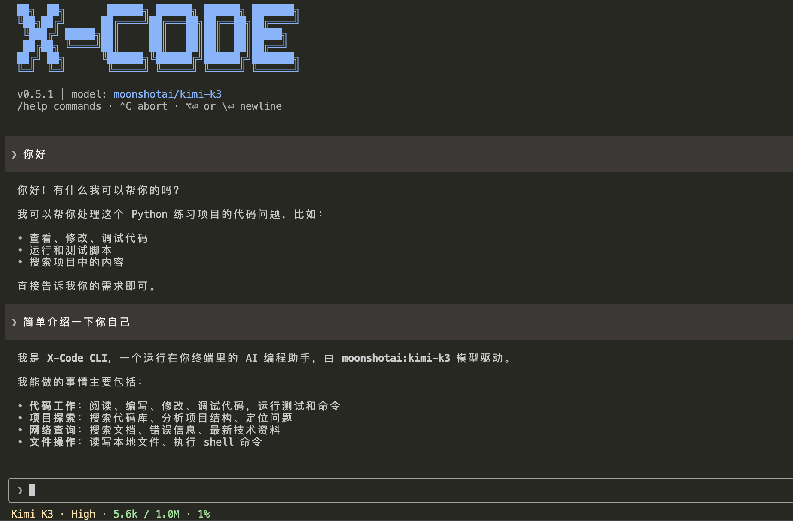

<div align="center">

# X-Code CLI

**不绑定模型、兼容 Claude Code 扩展生态的开源编程 Agent CLI。**

使用 Claude、GPT、Gemini、DeepSeek、Qwen、Kimi 或任意 OpenAI 兼容接口，复用同一套 Skills、Plugins、MCP 和 Agent 工作流。

[](https://www.npmjs.com/package/@x-code-cli/cli)
[](./LICENSE)

[English](./README.md) · 简体中文



</div>

## 为什么选 X-Code CLI？

**不绑定模型** — 通过 `/model` 随时切换提供商，也可以接入任意 OpenAI 兼容接口。同一套工作流，任意模型。

**兼容 Claude Code 扩展生态** — 直接复用为 Claude Code 构建的插件、Skills、子 Agent、MCP 服务器和 Hooks。插件加载器同时识别 `.x-code-plugin/` 和 `.claude-plugin/` 格式。

**开源可控** — 开源、BYOK、本地执行、三级权限模型可配置。你决定 Agent 能做什么。

**完整的 Agent 运行时** — 不只是对话封装，而是覆盖规划、执行、记忆、上下文管理和任务验证的完整开发工作流。

> X-Code CLI 是独立的开源项目，与 Anthropic 无关。

## 安装

> 需要 **Node.js >= 22**（不支持 Node 20）。

```bash
npm install -g @x-code-cli/cli

# 或
pnpm add -g @x-code-cli/cli
```

安装完成后，使用 `xc` 或 `x-code` 命令启动。

## 配置 API Key

> **X-Code CLI 不内置免费模型，须配置至少一个厂商的 API Key。**
>
> **推荐 [DeepSeek](https://platform.deepseek.com/)**：价格低、国内访问稳定、注册赠送初始额度，适合首次试用。

| 环境变量                       | 厂商                | 注册地址                                                                    |
| ------------------------------ | ------------------- | --------------------------------------------------------------------------- |
| `ANTHROPIC_API_KEY`            | Anthropic（Claude） | [console.anthropic.com](https://console.anthropic.com/)                     |
| `OPENAI_API_KEY`               | OpenAI（GPT）       | [platform.openai.com/api-keys](https://platform.openai.com/api-keys)        |
| `DEEPSEEK_API_KEY`             | DeepSeek            | [platform.deepseek.com/api_keys](https://platform.deepseek.com/api_keys)    |
| `GOOGLE_GENERATIVE_AI_API_KEY` | Google（Gemini）    | [aistudio.google.com/apikey](https://aistudio.google.com/apikey)            |
| `ALIBABA_API_KEY`              | 阿里通义（Qwen）    | [dashscope.console.aliyun.com](https://dashscope.console.aliyun.com/apiKey) |
| `XAI_API_KEY`                  | xAI（Grok）         | [console.x.ai](https://console.x.ai/)                                       |
| `ZHIPU_API_KEY`                | 智谱（GLM）         | [open.bigmodel.cn](https://open.bigmodel.cn/usercenter/apikeys)             |
| `MOONSHOT_API_KEY`             | Moonshot（Kimi）    | [按服务选择](#moonshot-kimi-endpoints)                                      |

**OpenAI 兼容接入**（vLLM / OpenRouter / 代理网关等）：同时设置 `OPENAI_COMPATIBLE_API_KEY` 与 `OPENAI_COMPATIBLE_BASE_URL`，模型 ID 写成 `custom:<your-model-id>`。

<details>
<summary><b>各 Shell 配置方式</b>（点击展开）</summary>

以下示例使用 `ANTHROPIC_API_KEY`，请替换为实际厂商变量名。

**bash（Linux / Git Bash / WSL）**

```bash
echo 'export ANTHROPIC_API_KEY=sk-ant-...' >> ~/.bashrc
source ~/.bashrc
```

**zsh（macOS 默认）**

```bash
echo 'export ANTHROPIC_API_KEY=sk-ant-...' >> ~/.zshrc
source ~/.zshrc
```

**fish**

```fish
set -Ux ANTHROPIC_API_KEY sk-ant-...
```

**Windows PowerShell（用户级，永久生效）**

```powershell
[Environment]::SetEnvironmentVariable('ANTHROPIC_API_KEY', 'sk-ant-...', 'User')
# 重启 PowerShell 后生效
```

**Windows CMD（用户级，永久生效）**

```cmd
setx ANTHROPIC_API_KEY "sk-ant-..."
:: 重启 CMD 后生效
```

> 临时使用：`export X=...`（bash）或 `$env:X = '...'`（PowerShell），终端关闭后失效。
>
> 项目级配置：在项目根目录放置 `.env` 文件，`xc` 会从当前目录向上逐层加载。

</details>

<details>
<summary><b>网页搜索 Key（可选）</b></summary>

启用 `web_search` 工具需任选一项配置，两家均提供免费额度：

| 环境变量         | 提供方                                        | 免费额度                  | 注册门槛         |
| ---------------- | --------------------------------------------- | ------------------------- | ---------------- |
| `TAVILY_API_KEY` | [Tavily](https://tavily.com)                  | 每月 ~1,000 次            | 邮箱，无需信用卡 |
| `BRAVE_API_KEY`  | [Brave Search](https://brave.com/search/api/) | 每月 ~1,000 次（$5 额度） | 需绑定信用卡     |

> 推荐首次配 Tavily：注册简便，返回格式针对 LLM 优化。同时配置时优先 Tavily，未配时自动回退 Brave。

</details>

<details id="moonshot-kimi-endpoints">
<summary><b>Moonshot（Kimi）端点说明</b></summary>

Moonshot/Kimi 提供三套独立的凭证与端点，API Key 只能用于签发它的服务：

- Kimi Code 订阅计划：[Kimi Code 控制台](https://www.kimi.com/code/console) → `https://api.kimi.com/coding/v1`
- 国内开放平台：[platform.kimi.com](https://platform.kimi.com/console/api-keys) → `https://api.moonshot.cn/v1`
- 国际开放平台：[platform.kimi.ai](https://platform.kimi.ai/console/api-keys) → `https://api.moonshot.ai/v1`

通过 `/model` 选择 Kimi 模型后，X-Code CLI 会自动显示端点选择器。

</details>

## 快速上手

```bash
cd your-project

xc                                   # 启动交互式会话
xc "解释项目的整体架构"                # 带提示词运行
xc -m sonnet "重构 formatDate 函数"    # 指定模型
```

## 核心功能

### 智能开发

- **内置工具** — 文件读写、Shell 执行、代码搜索（Grep / Glob）、网页抓取、子 Agent 委派、Todo 追踪等
- **子 Agent** — 内置 5 个（explore / general-purpose / plan / code-reviewer / goal-verifier），支持自定义
- **Plan 模式** — `--plan` 或 `/plan` 进入只读探索，Agent 先制定方案、批准后再执行
- **持续目标循环** — `/goal` 自动执行→验证→修复，直到验证通过或触发停止条件
- **文件附件** — `@path` 或裸绝对路径引用文件，自动识别 text / code / PDF / Office 文档（docx / xlsx / pptx / odt / ods / odp）/ 图片 / 音频
- **本地音频转写** — 附件支持 MP3 / WAV / M4A / OGG / FLAC / AAC / AIFF / WMA / WebM / Opus；当前模型不支持音频输入时，X-Code CLI 用 Whisper（whisper.cpp）在本地转写，只把带时间戳的文字交给模型——音频不会离开你的电脑。Whisper 模型首次使用时自动下载，缓存于 `~/.x-code/whisper-models/`（默认 `tiny`，可通过 `X_CODE_WHISPER_MODEL` 换成其他型号，如 `base`）
- **视觉辅助** — DeepSeek 等纯文本模型可借用其他多模态厂商生成图片描述

### 上下文管理

- **知识库系统** — 分层加载 `AGENTS.md`（兼容 `CLAUDE.md`），子包可覆盖根级约定
- **自动记忆** — 每轮对话后自动保存用户偏好、纠正反馈等长期事实，下次会话自动加载
- **会话恢复** — `--continue` 恢复最近会话，`--resume` 打开选择器或按 ID 直达
- **上下文压缩** — 长对话自动压缩；loop-guard 检测循环调用；prompt cache 复用前缀
- **三级权限模型** — 默认安全，写操作前请求确认；`--trust` 跳过

### 扩展生态

- **MCP 集成** — 支持 stdio + HTTP（含 OAuth），`/mcp` 管理，服务器工具自动并入 Agent 工具集
- **插件系统** — skill / sub-agent / MCP / hooks 打包分发；与 Claude Code 插件格式兼容
- **Skills** — `SKILL.md` 描述可复用工作流模板，`/<skill-name>` 触发
- **自定义斜杠命令** — markdown 文件放进 `~/.x-code/commands/` 或项目级目录，`/<name>` 直接使用
- **Hooks** — 10 个生命周期事件回调，用 shell 命令拦截/改写 Agent 行为
- **浏览器自动化** — `/browser on` 启用真实浏览器子 Agent（Playwright 驱动），默认关闭

### 终端体验

- **流式输出** — 边生成边显示
- **主题切换** — `/theme` 控制 diff 配色和语法高亮风格
- **统一思考模式** — `/thinking on|off` 将各厂商的 thinking 参数统一为单一开关
- **多行输入** — `Alt+Enter` 或行尾 `\` 插入换行
- **历史回溯** — 空输入框时 `↑`/`↓` 召回已提交的提示词
- **中途转向（steering）** — Agent 运行中也能继续输入：消息先排队显示在 spinner 上方，在下一个工具边界自动注入
- **实时页脚** — 输入框下方常驻当前模型与上下文用量（如 `Kimi K3 · 6.6k / 200k · 3%`）
- **跨平台** — Windows、macOS、Linux

## 命令行参数

```text
xc [options] [prompt]

--model, -m <id>      指定模型（如 sonnet、deepseek、openai:gpt-5.6-sol）
--trust, -t           信任模式：跳过写操作确认
--print, -p           非交互模式：输出结果后退出
--plan                Plan 模式（只读探索，批准后才执行）
--continue, -c        恢复最近一次会话
--resume, -r [id]     恢复会话：无参数打开选择器，指定 ID 直达
--max-turns <n>       Agent 循环轮次上限（默认无上限）
--no-plugins          禁用插件系统（排障用）
--no-hooks            跳过所有 hook 执行
--plugin-debug        把 plugin/hook 调试日志镜像到 stderr
--version, -v         显示版本号
--help, -h            显示帮助信息
```

### 非交互子命令

```text
xc plugin <subcommand>            管理插件（list / install / uninstall / enable / disable / search / update / info / doctor / marketplace）
xc plugin install [--yes] <src>   安装插件；非 TTY 默认拒绝，--yes 跳过确认
xc plugin marketplace <sub>       管理插件市场订阅（list / add / remove / refresh / info）
```

## 斜杠命令

| 命令                  | 说明                                                                                |
| --------------------- | ----------------------------------------------------------------------------------- |
| `/help`               | 查看所有可用命令                                                                    |
| `/model [alias]`      | 切换模型或查看可用模型列表                                                          |
| `/thinking [on\|off]` | 启用 / 禁用思考模式                                                                 |
| `/theme [name]`       | 切换 UI 主题                                                                        |
| `/plan [on\|off]`     | 启用 / 禁用 Plan 模式                                                               |
| `/goal [目标]`        | 启动持续目标循环（详见 [docs/goal.md](./docs/goal.md)）                             |
| `/usage`              | 查看本次会话 Token 用量（含分步明细）                                               |
| `/usage-history`      | 列出历史会话用量                                                                    |
| `/clear`              | 清空当前会话                                                                        |
| `/compact`            | 手动压缩上下文                                                                      |
| `/resume`             | 从历史会话中选择恢复                                                                |
| `/rewind`             | 回到某条用户消息之前（还原文件 + 截断历史）                                         |
| `/init`               | 分析代码库后创建或更新 `AGENTS.md`                                                  |
| `/review [PR号]`      | 评审 GitHub PR（需本地装好 `gh`）                                                   |
| `/memory [子命令]`    | 查看、搜索、解释或重载全局长期记忆（详见 [docs/knowledge.md](./docs/knowledge.md)） |
| `/skill <sub>`        | 管理 Skills                                                                         |
| `/mcp <sub>`          | 管理 MCP 服务器                                                                     |
| `/plugin <sub>`       | 管理插件与 marketplace                                                              |
| `/browser [on\|off]`  | 开关浏览器子 Agent（默认关闭）                                                      |
| `/doctor`             | 一键诊断运行环境                                                                    |
| `/exit`               | 保存会话并退出                                                                      |

## 详细文档

README 是入门视图，每个功能的完整用法在 [`docs/`](./docs/) 下（中文 `*.md`，英文 `*.en.md`）：

| 文档                                                     | 内容                                 |
| -------------------------------------------------------- | ------------------------------------ |
| [`docs/skills.md`](./docs/skills.md)                     | 可复用工作流模板                     |
| [`docs/goal.md`](./docs/goal.md)                         | 持续目标循环（`/goal`）              |
| [`docs/sub-agents.md`](./docs/sub-agents.md)             | 内置 / 自定义子 Agent（`task` 工具） |
| [`docs/mcp.md`](./docs/mcp.md)                           | MCP 服务器配置                       |
| [`docs/knowledge.md`](./docs/knowledge.md)               | 知识库（5 层加载）与自动记忆         |
| [`docs/plugins.md`](./docs/plugins.md)                   | 插件安装 / 管理                      |
| [`docs/marketplace.md`](./docs/marketplace.md)           | 插件市场订阅 / 自建                  |
| [`docs/hooks.md`](./docs/hooks.md)                       | Agent 生命周期 Hook                  |
| [`docs/plugin-authoring.md`](./docs/plugin-authoring.md) | 插件开发指南                         |

## 故障排查

临时设置 `DEBUG_STDOUT=1` 启动即可捕获调试日志：

```bash
# bash / zsh
DEBUG_STDOUT=1 xc

# fish
env DEBUG_STDOUT=1 xc

# PowerShell
$env:DEBUG_STDOUT=1; xc

# CMD
set DEBUG_STDOUT=1 && xc
```

日志路径：`~/.x-code/logs/debug.log`（Windows: `%USERPROFILE%\.x-code\logs\debug.log`），单文件 10 MB，滚动备份 ~20 MB。

## 从源码运行

```bash
git clone https://github.com/woai3c/x-code-cli.git
cd x-code-cli
pnpm install
pnpm dev
```

> 修改源码后需 `pnpm build` 或 `pnpm dev`。自动监听可在 `packages/core` 下运行 `pnpm dev`（`tsc -b --watch`）。

## 配套小册

想深入了解实现原理，可参考掘金配套小册：[**《从零打造一个 AI Agent CLI》**](https://juejin.cn/book/7639017024882278440?suid=1433418893103645&source=h5)，以本仓库源码为参照，逐章拆解 Agent Loop、多厂商适配、终端渲染、权限模型等。

- **QQ 交流群：455053594**
- **微信：fullstack-xf**

## 反馈与贡献

欢迎通过 Issue 和 Pull Request 反馈：<https://github.com/woai3c/x-code-cli>

## License

[MIT](./LICENSE)
